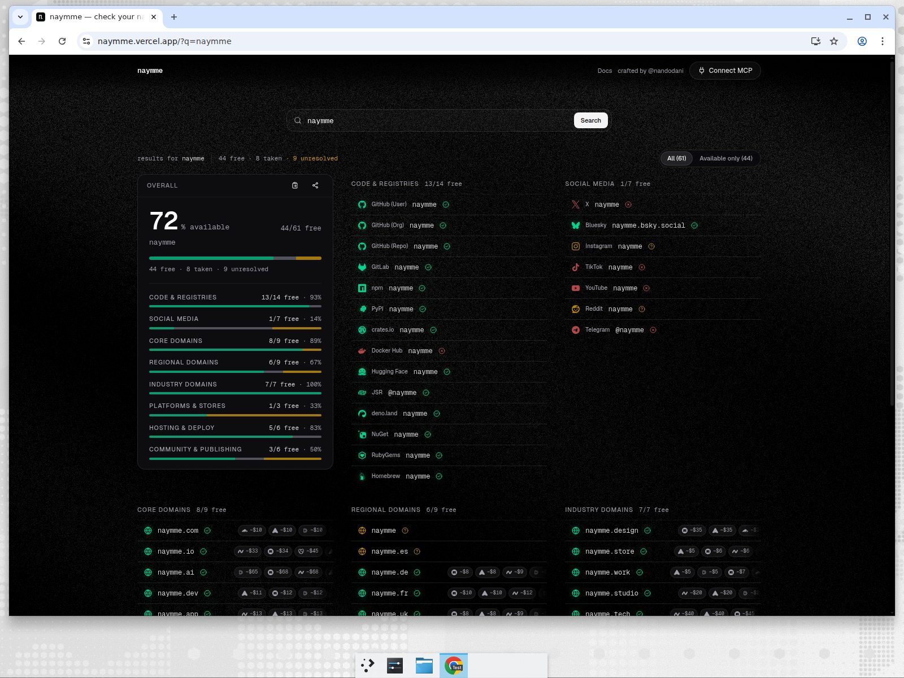

<div align="center">
  

  <h1>naymme</h1>

  <p><strong>Check a name everywhere before you commit to it.</strong></p>

  <p>
    One search fans out to 61 sources — domains, code registries, hosted
    platforms, app stores and socials — and scores the name as a brand.
    Ships as a web app, a public API, and an MCP server for AI agents.
  </p>

  <p>
    <a href="https://github.com/nandodani/naymme/actions/workflows/ci.yml"></a>
    <a href="LICENSE"></a>
    
    <a href="https://modelcontextprotocol.io"></a>
  </p>

  <p>
    <a href="https://naymme.vercel.app"><strong>Live app</strong></a> ·
    <a href="https://naymme.vercel.app/api/mcp">Hosted MCP endpoint</a> ·
    <a href="docs/README.md">Docs</a> ·
    <a href="CONTRIBUTING.md">Contributing</a>
  </p>

  
</div>

<br />

## What it does

naymme answers two questions about a candidate name:

1. **`check_availability`** — is it free? Queried in parallel against 61
   providers: `.com`/`.dev`/`.io`/`.ai` and 21 more TLDs plus ccTLDs
   (`.pt`/`.de`/`.fr`/`.uk`/…), GitHub user/org/repo and GitLab, npm, PyPI,
   crates.io, Docker Hub, JSR, deno.land, NuGet, RubyGems, Homebrew,
   Hugging Face, hosted subdomains (vercel.app, netlify.app, pages.dev,
   fly.dev, up.railway.app, supabase.co), the App Store, CodePen, Replit,
   Figma, Dribbble, Behance, Substack, Product Hunt, Telegram, Medium, and
   socials (X, Bluesky, Instagram, Reddit, YouTube, TikTok).
2. **`score_name`** — how good is it as a brand? A deterministic heuristic
   scored out of 100 — same input, same answer, no network.

Each result is a normalized verdict — `available`, `taken`, `unknown` or
`invalid` — and `available` is only claimed on a verified unclaimed marker
(an RDAP 404, a registry miss). A provider that times out or can't decide
reports `unknown`, never a fabricated `available`.

## Try it now

**Use the hosted endpoint** — no install, no API key:

```bash
curl "https://naymme.vercel.app/api/availability?name=acme&providers=github,npm,domain:com"
curl "https://naymme.vercel.app/api/score?name=acme"
```

**Install the MCP server** — the `naymme` npm package runs as a single
stdio command with no API keys (publication pending — see
[`docs/mcp-registry.md`](docs/mcp-registry.md) for status):

```bash
npx -y naymme
```

Client setup — the same invocation works everywhere:

| Client         | Where it goes                                                                                                   |
| -------------- | --------------------------------------------------------------------------------------------------------------- |
| Claude Desktop | `claude_desktop_config.json` → `mcpServers`: `{ "naymme": { "command": "npx", "args": ["-y", "naymme"] } }`     |
| Cursor         | `~/.cursor/mcp.json` → `mcpServers` (same JSON as above)                                                        |
| Windsurf       | `mcp_config.json` → `mcpServers` (same JSON as above)                                                           |
| VS Code        | `.vscode/mcp.json` → `servers`: `{ "naymme": { "type": "stdio", "command": "npx", "args": ["-y", "naymme"] } }` |
| Claude Code    | `claude mcp add naymme -- npx -y naymme`                                                                        |
| Smithery       | `npx -y @smithery/cli install naymme --client claude` (after the Smithery listing lands)                        |

Or hack on a clone — `npm install && npm run build` — then point the
client at `node /absolute/path/to/naymme/dist/index.js` instead of `npx`.

Registry submissions (official MCP registry, Smithery, catalogues) are
tracked in [`docs/mcp-registry.md`](docs/mcp-registry.md).

**Point a remote client at the hosted MCP** (stateless Streamable HTTP):

```json
{
  "mcpServers": {
    "naymme": {
      "command": "npx",
      "args": ["mcp-remote", "https://naymme.vercel.app/api/mcp"]
    }
  }
}
```

## Runtimes

The same TypeScript codebase ships four interchangeable surfaces — same
tools, same schemas, same response contract:

| Surface            | Entry             | Use it for                                                    |
| ------------------ | ----------------- | ------------------------------------------------------------- |
| Web app + JSON API | `app/` + `lib/`   | The checker UI, `/api/availability`, `/api/score`, `/api/mcp` |
| stdio MCP server   | `src/index.ts`    | Local assistants (Claude Desktop, Cursor)                     |
| Node HTTP server   | `src/http.ts`     | Self-hosted Streamable HTTP + legacy SSE                      |
| Cloudflare Worker  | `worker/index.ts` | Edge deployment, web-standard APIs only                       |

```bash
npm run dev:web      # Next.js dev — UI at / and MCP at /api/mcp
npm run dev          # stdio server via tsx
npm run dev:http     # Node HTTP server via tsx
npm run dev:worker   # Cloudflare Worker via wrangler dev
```

## The tools

### `check_availability`

```jsonc
{ "name": "acme", "providers": ["github", "npm", "domain:com"] }
```

`providers` accepts any subset of the 61 provider ids plus the aliases
`all` (default), `domains`, `domains:all`, `domains:cctld` and `socials`.
Every adapter validates the name **before** touching the network, then runs
concurrently (`Promise.allSettled`) under its own 5-second timeout — one
slow provider never blocks the batch:

```jsonc
{
  "provider": "domain:com",
  "status": "available", // available | taken | unknown | invalid
  "subject": "acme.com",
  "available": true, // true | false | null (=unknown)
  "detail": "rdap: https://rdap.verisign.com/com/v1/domain/acme.com",
  "durationMs": 241,
}
```

Domain checks resolve through a layered chain — **RDAP** where the registry
publishes it, **WHOIS** for the rest, **DNS NS** as a last-resort existence
signal. Registry and platform checks ask the canonical source directly.

### `score_name`

```jsonc
{ "name": "acme" }
```

| Component          | Max | What it rewards                                           |
| ------------------ | --- | --------------------------------------------------------- |
| `punchiness`       | 25  | Length; peaks at 5–8 chars                                |
| `syllables`        | 15  | Estimated vowel-group count; peaks at 2–3                 |
| `pronounceability` | 25  | Familiar English bigrams; cluster/vowel-balance penalties |
| `uniqueness`       | 20  | Coinages over common/over-used words; distinctive letters |
| `cleanliness`      | 15  | Letters only; penalties for digits, separators, repeats   |

`total` (0–100) maps to a grade: ≥85 `Excellent`, ≥70 `Strong`, ≥55 `Fair`,
≥40 `Weak`, else `Poor`. Formula in [`src/scoring/score.ts`](src/scoring/score.ts),
pinned by tests.

## Agent-readiness

The hosted surface is built to be consumed by agents, not just browsers:

- **Versioned API**: `/api/v1/*` canonical, `API-Version: 1` on every
  response, `Deprecation`/`Sunset`/`Link` policy documented in `/auth.md`.
- **RFC RateLimit headers** on everything (including errors): `RateLimit-*`
  - `Retry-After` on 429. No API key — the OAuth discovery documents
    (`.well-known/oauth-protected-resource`, RFC 9728 and
    `oauth-authorization-server`, RFC 8414) declare the public no-token tier.
- **Discovery**: `/openapi.json` (OpenAPI 3.1), `/.well-known/api-catalog`
  (RFC 9264 linkset), `/.well-known/mcp` + `server-card.json` (SEP-1649),
  `/.well-known/agent-skills/index.json` (agent-skills RFC + sha256),
  `/.well-known/ai-catalog.json`, `/llms.txt` + `/llms-full.txt`, `/auth.md`.
- **Content negotiation**: `Accept: text/markdown` returns every page as
  markdown; `Accept: application/json` gets a structured error envelope —
  even on unknown paths. DNS discovery records are documented in
  [DNS-AID.md](DNS-AID.md).

> Results are **snapshots, not guarantees**. Registries lag, names get
> taken between the check and checkout, and reserved names can look free.
> Re-confirm at the registrar or platform before committing — and note that
> `unknown` ≠ `taken`.

## Deploy your own

```bash
# Vercel — web UI + /api/mcp in one deployment
vercel deploy --prod

# Cloudflare Workers — stateless Streamable HTTP at /mcp
npm run deploy:worker

# Any persistent Node host — Streamable HTTP + legacy SSE
npm ci && npm run build && PORT=3000 npm run start:http
```

Serverless caveats: only the stateless Streamable HTTP transport works
per-request (no standalone SSE stream), and WHOIS needs raw TCP port 43 —
blocked on some platforms, where affected TLDs degrade to `unknown` (or to
the DNS-NS check on Workers). Details in
[`docs/deployment.md`](docs/deployment.md).

Set `NAYMME_AVAILABILITY_MODE=demo` to serve deterministic fixture data —
no network, no credentials — for offline development, previews and CI.

## Documentation

Deep dives live in [`docs/`](docs/README.md): the
[provider catalog](docs/providers.md), the
[availability chain & registrar pricing](docs/registrars-pricing.md), the
[adapter architecture](docs/architecture.md), the full
[API reference](docs/api-reference.md),
[deployment](docs/deployment.md) and
[troubleshooting](docs/troubleshooting.md). Contributor-facing rules are in
[AGENTS.md](AGENTS.md).

## Contributing

Contributions welcome — see [CONTRIBUTING.md](CONTRIBUTING.md) for setup,
the `npm run check` gate, and the provider contract. Bugs and feature
requests go in [Issues](https://github.com/nandodani/naymme/issues);
security reports go through
[private vulnerability reporting](SECURITY.md), not public issues.

## License

[MIT](LICENSE) — © 2026 [Fernando Apóstolo](https://nandodani.dev).
